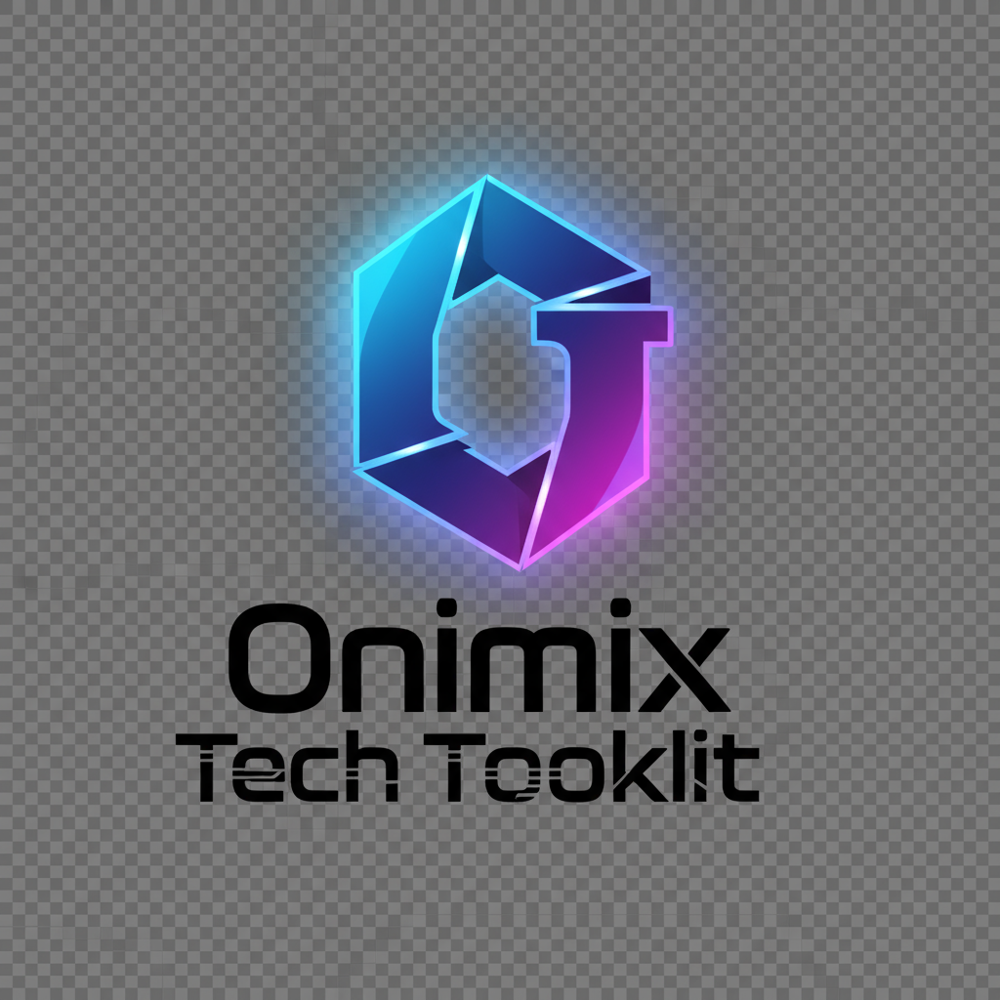

# Onimix Tech Toolkit

The Ultimate Free Tool Collection with 100+ tools for developers, SEO experts, and students. All tools are free, fast, and work offline when possible.



## 🚀 Features

### 📝 Text Analysis Tools
- **Word Counter & Text Analyzer** - Real-time text statistics with detailed metrics
- **Case Converter** - Convert between 10+ case formats (uppercase, lowercase, camelCase, snake_case, etc.)
- **Hash Generator** - Generate MD5, SHA-1, SHA-256, and SHA-512 hashes
- **Text Reverser** - Reverse text by characters, words, or lines
- **Lorem Ipsum Generator** - Generate placeholder text for design projects
- **Text Cleaner** - Clean and format text by removing unwanted characters

### 🖼️ Image Processing Tools
- **Image Compressor** - Compress images to target file sizes while maintaining quality
- **Format Converter** - Convert between PNG, JPEG, WebP, and other formats
- **Image Resizer** - Resize images with aspect ratio control
- **Favicon Generator** - Generate favicons in multiple sizes
- **Color Palette Extractor** - Extract dominant colors from images

### 🔍 SEO & Marketing Tools (Planned)
- **Keyword Density Checker** - Analyze keyword density in content
- **SEO Score Analyzer** - Comprehensive SEO analysis
- **Backlink Checker** - Check and analyze backlinks
- **Meta Tags Generator** - Generate Open Graph and Twitter Card meta tags

### 🌐 Web Development Tools (Planned)
- **HTML/CSS/JS Minifier** - Minify code for production
- **Code Formatter** - Format and beautify code
- **QR Code Generator** - Generate QR codes for URLs and text
- **URL Shortener** - Create short URLs

### 📄 PDF & Document Tools (Planned)
- **PDF Merger & Splitter** - Combine and split PDF files
- **PDF Compressor** - Reduce PDF file sizes
- **Document Converter** - Convert between document formats

### 🧮 Calculators (Planned)
- **Scientific Calculator** - Advanced mathematical calculations
- **Unit Converter** - Convert between different units
- **Percentage Calculator** - Calculate percentages and ratios

## 🎨 Design Features

- **Modern UI/UX** - Futuristic design with glowing effects and smooth animations
- **Dark/Light Mode** - Toggle between dark and light themes
- **Responsive Design** - Works perfectly on desktop, tablet, and mobile
- **Interactive Dashboard** - Easy navigation with search and categories
- **Professional Branding** - Consistent Onimix Tech branding throughout

## 🛠️ Technical Stack

- **Frontend**: Next.js 15, React 18, TailwindCSS
- **Animations**: Framer Motion
- **Icons**: Lucide React
- **Utilities**: Crypto-JS, JSZip, File-Saver
- **Styling**: TailwindCSS with custom design system
- **Deployment**: Vercel-ready configuration

## 📦 Installation & Setup

### Prerequisites
- Node.js 18+ 
- npm or yarn

### Quick Start

1. **Clone the repository**
   ```bash
   git clone <repository-url>
   cd onimix-tech-toolkit
   ```

2. **Install dependencies**
   ```bash
   npm install
   ```

3. **Start development server**
   ```bash
   npm run dev
   ```

4. **Open in browser**
   ```
   http://localhost:3000
   ```

### Build for Production

```bash
npm run build
npm start
```

## 📁 Project Structure

```
onimix-tech-toolkit/
├── components/
│   ├── ui/                 # Reusable UI components
│   ├── layout/             # Layout components
│   └── tools/              # Tool-specific components
│       ├── text/           # Text analysis tools
│       ├── image/          # Image processing tools
│       ├── seo/            # SEO tools
│       └── web/            # Web development tools
├── pages/
│   ├── tools/              # Tool pages
│   ├── _app.js             # App configuration
│   ├── _document.js        # Document configuration
│   └── index.js            # Home page
├── utils/
│   ├── text/               # Text processing utilities
│   ├── image/              # Image processing utilities
│   └── seo/                # SEO utilities
├── styles/
│   └── globals.css         # Global styles
├── public/
│   ├── logo.png            # Onimix logo
│   └── favicon.png         # Favicon
└── README.md
```

## 🔧 Available Scripts

- `npm run dev` - Start development server
- `npm run build` - Build for production
- `npm start` - Start production server
- `npm run lint` - Run ESLint
- `npm run export` - Export static files

## 🌟 Key Features

### ✨ User Experience
- **No Registration Required** - Start using tools immediately
- **Offline Functionality** - Many tools work without internet
- **Fast Performance** - Optimized for speed and efficiency
- **Mobile Friendly** - Responsive design for all devices

### 🔒 Privacy & Security
- **Client-Side Processing** - Most tools process data locally
- **No Data Storage** - We don't store your personal data
- **Secure Hashing** - Industry-standard cryptographic functions
- **Open Source** - Transparent and auditable code

### 🎯 Developer Friendly
- **Modern Tech Stack** - Built with latest technologies
- **Component Architecture** - Modular and maintainable code
- **TypeScript Ready** - Easy to migrate to TypeScript
- **Extensible Design** - Easy to add new tools

## 🚀 Deployment

### Vercel (Recommended)
1. Push code to GitHub
2. Connect repository to Vercel
3. Deploy automatically

### Netlify
1. Build the project: `npm run build`
2. Deploy the `out` folder to Netlify

### Custom Hosting
1. Build the project: `npm run build`
2. Upload the `out` folder to your hosting provider

## 🤝 Contributing

We welcome contributions! Please follow these steps:

1. Fork the repository
2. Create a feature branch: `git checkout -b feature/new-tool`
3. Commit changes: `git commit -am 'Add new tool'`
4. Push to branch: `git push origin feature/new-tool`
5. Submit a Pull Request

## 📝 Adding New Tools

To add a new tool:

1. Create component in `components/tools/[category]/`
2. Add utility functions in `utils/[category]/`
3. Create page in `pages/tools/[category]/`
4. Update tools index in `pages/tools/index.js`
5. Add to main dashboard in `pages/index.js`

## 🐛 Known Issues

- Minor runtime issue with component imports (being resolved)
- Some advanced features still in development

## 📄 License

This project is licensed under the MIT License - see the [LICENSE](LICENSE) file for details.

## 🙏 Acknowledgments

- Icons by [Lucide](https://lucide.dev/)
- Animations by [Framer Motion](https://www.framer.com/motion/)
- Styling by [TailwindCSS](https://tailwindcss.com/)

## 📞 Support

For support, email support@onimix.tech or create an issue on GitHub.

---

**Onimix Tech Toolkit** - Making developer tools accessible to everyone, everywhere, for free.

